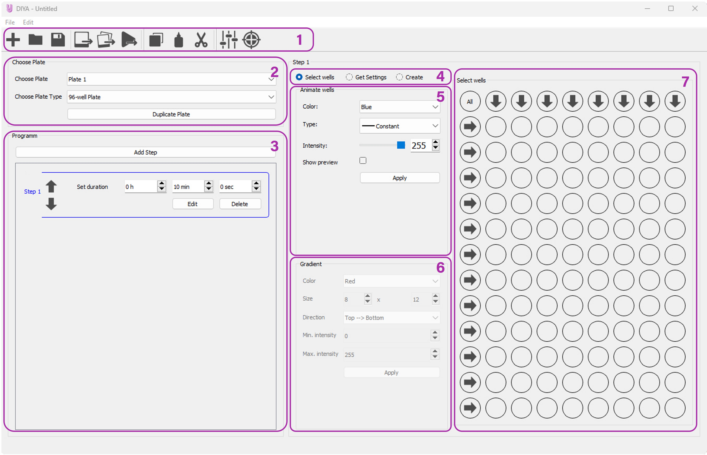

# LED matrix based optogenetic platform

# DIYA - The lightcage GUI

User guide for DIYA version 1.0.0-alpha

## Installation Instructions

Currently DIYA is only available for Windwos. DIYA can be installed via the installer on Windows 11/10/8/7/Vista/XP. Installation should not take more than 5 minutes. 
The images and GIFs generated by DIYA can then be played on the LED matrix via Huidu's ***HDPlayer***. More information and the installation instructions for the HDPlayer can be found [here](https://www.huidu.cn/download/128.html).

## Usage

### Overview

DIYA provides a graphical user interface for creating optogentic experiments for the Lightcage platform.

DIYA offers the possibility to illuminate two cell culture plates individually at the same time. 96-, 24- and 6-well plates can be programmed. The programming takes place in steps. In each step, individual static or periodic illumination can be programmed for all wells. Any number of steps can be created, which are then played back one after the other.

So the general workflow looks like this.

1. Set the **illumination parameters**
2. Assign illumination parameters to **wells**.
3. Add more **steps** to the program. 
4. **Export** and **upload** to the LED matrix.

### Quick Start

This section will briefly explain how to execute the basic workflow.

1. When opening the application, the plate size must be selected first, by default a 96-well plate is set.
2. Next you have to set the step length for the first step, by default it is 10 min.
3. The first step can be programmed. To do this, first select the color and then the type of animation in the _Animate wells_ box. Depending on the type, certain parameters like intensity or wavelength can be set now. To better visualize the animation, a preview can be shown via the _show preview_ checkbox.
4. After the parameters have been set as desired, the wells that are to be illuminated can be selected in the interactiv preview. By pressing the _Apply_ button, the selected wells are programmed with the selected parameters.
5. Steps three and four can be repeated for as many different parameters and wells as desired. 
6. After the programming of the first step for the first plate is completed, the second plate can be programmed if desired. To do this, plate two must be selected in the _Choose Plate_ box and the programming can be repeated for plate two as described above. Alternatively, the settings of plate one can be duplicated on plate one. To do this, select the plate to be duplicated (in this example plate one) and then press the _Duplicate Plate_ button.
7. Using the _Add Step_ button in the _Program_ box, additional steps can be added and programmed as described in 1-6.
8. Finally, the finished program can be exported as a GIF and spooled onto the LED matrix via _HDPlayer_.
 
If you identify issues during configurating or running your illumination protocols, please contact us!

## Interface

<a href="docs/images/DIYA_screenshot_labeled.jpg"></img></a>

_The main application window._

The application window is separated into a few distinct areas:

1. Toolbar
2. Plate Selector
3. Program Editor
4. Selection Type selector
5. Parameter Settings 
6. Gradient Designer
7. Interactiv Preview

### Toolbar
> The toolbar offers the possibility to quickly create, open or save a new file. In addition, the toolbar can be used to export the program as a GIF or as frames and the current settings as an image. In addition, selected wells can be copied, pasted or cut. Furthermore, the Advanced Settings and the Calibration options can be opened.

