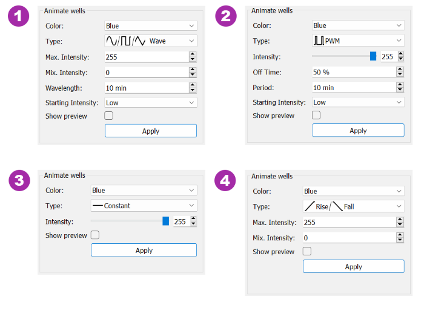
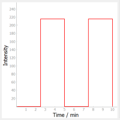

# DIYA GUI

User guide for DIYA GUI version 1.0.1

# Installation Instructions

You can either run the DIYA GUI as an executable if you install it via the installer or run it yourself via python.

## Option 1: Installing the Compiled Version

For users who just want to run the application without the need to compile, please follow these steps:

1. Download the installer from the Releases section of this repository.
2. Run the installer and follow the instructions on the screen.
3. Once installed, you should be able to find "DIYA" in your list of installed applications.

Currently the DIYA Installer is only available for Windwos. DIYA can be installed via the installer on Windows 11/10/8/7/Vista/XP.

## Option 2: Running the Source Code

For users who want to compile and run the source code, please follow these steps:

### Prerequisites:

- Python (3.6 or above) and pip (Python package manager)

If Python and pip are not already installed on your computer, follow these instructions:

- For Windows users, visit the official [Python downloads page](https://www.python.org/downloads/windows/) and download and install the version suitable for your system.
- For MacOS users, use the preinstalled Python, or visit the official [Python downloads page](https://www.python.org/downloads/mac-osx/).
- For Linux users, Python is likely already installed on your machine. If not, you can install it using your distribution's package manager.

### Steps:

1. **Set up a virtual environment (recommended)**

   - Open a terminal (or command prompt on Windows)
   - Navigate to the directory you want to contain your project
   - Run the following commands:
   
     ```
     python3 -m venv diyavenv
     ```
     This command creates a new directory `diyavenv` which contains the directories and Python scripts necessary to set up a virtual environment.

     To activate the environment, run:

     - On Windows:
     ```
     .\diyavenv\Scripts\activate
     ```
     - On Unix or MacOS:
     ```
     source diyavenv/bin/activate
     ```

   - Your terminal prompt should now show the name of your activated environment.

2. **Clone the DIYA GitHub repository**

   In the terminal, run the following command:
   
   ```
   git clone https://github.com/santkumar/diya
   ```

3. **Navigate to the DIYA directory**

   ```
   cd DIYA/software/gui
   ```

4. **Install the required Python packages**

   ```
   pip install -r requirements.txt
   ```

5. **Run the application**

   ```
   python setup.py
   ```

That's it! You should now be able to run the DIYA GUI on your computer.

## Playing GIFs on the DIYA Platform

The images and GIFs that you generate with the DIYA GUI can be displayed on the DIYA LED platform using Huidu's HDPlayer.

### Steps:

1. **Install HDPlayer**

   HDPlayer is necessary to send the GIFs to the LED matrix. Visit [this page](https://www.huidu.cn/download/128.html) to download and install the HDPlayer software. The page also includes comprehensive instructions for installation and setup.

2. **Upload your GIF**

   After generating your GIF with DIYA, open HDPlayer and use the upload feature to send the GIF to your LED matrix. If you need help with this step, consult the HDPlayer user manual or the resources available on the Huidu website.

This should allow you to display your custom-made DIYA GIFs on your DIYA LED Matrix.


# Usage

## Overview

The DIYA GUI provides a graphical user interface for creating optogentic experiments for the DIYA LED platform.

DIYA offers the possibility to illuminate two cell culture plates individually at the same time. 96-, 24- and 6-well plates can be programmed. The programming takes place in steps. In each step, individual static or periodic illumination can be programmed for all wells. Any number of steps can be created, which are then played back one after the other.

So the general workflow looks like this.

1. Set the **illumination parameters**
2. Assign illumination parameters to **wells**.
3. Add more **steps** to the program. 
4. **Export** and **upload** to the LED matrix.

## Quick Start

This section will briefly explain how to execute the basic workflow.


1. When opening the application, the plate size must be selected first, by default a 96-well plate is set.
2. Next you have to set the step length for the first step, by default it is 10 min.
3. The first step can be programmed. To do this, first select the color and then the type of animation in the _Animate wells_ box. Depending on the type, certain parameters like intensity or wavelength can be set now. To better visualize the animation, a preview can be shown via the _show preview_ checkbox.
4. After the parameters have been set as desired, the wells that are to be illuminated can be selected in the interactiv preview. By pressing the _Apply_ button, the selected wells are programmed with the selected parameters.
5. Steps three and four can be repeated for as many different parameters and wells as desired. 
6. After the programming of the first step for the first plate is completed, the second plate can be programmed if desired. To do this, plate two must be selected in the _Choose Plate_ box and the programming can be repeated for plate two as described above. Alternatively, the settings of plate one can be duplicated on plate one. To do this, select the plate to be duplicated (in this example plate one) and then press the _Duplicate Plate_ button.
7. Using the _Add Step_ button in the _Program_ box, additional steps can be added and programmed as described in 1-6.
8. Finally, the finished program can be exported as a GIF and spooled onto the LED matrix via _HDPlayer_.
 
If you identify issues during configurating or running your illumination protocols, please contact us!

## Interface

<a href="docs/images/DIYA_screenshot_labeled.png"></img></a>

_The main application window._

The application window is separated into a few distinct areas:

1. [Toolbar](#markdown-header-Toolbar)
2. [Plate Selector](#markdown-header-Plate-Selector)
3. [Program Editor](#markdown-header-Program-Editor)
4. [Selection Type selector](#markdown-header-Selection-Type-selector)
5. [Parameter Settings](#markdown-header-Parameter-Settings)
6. [Gradient Designer](#markdown-header-Gradient-Designer)
7. [Interactive Preview](#markdown-header-Interactive-Preview)


---


### Toolbar
> The toolbar allows conveniently opening, saving, starting new programs or exporting programs as well as accessing additional options.


#### New/Open/Safe
- *Plus Button:*

    By clicking the Plus button a new pattern can be programmed.

- *Folder Button:*

    By clicking the folder button a saved program can be opened.

- *Disk Button:*

    By clicking the disk symbol the current program can be saved


#### Export
> By default, the programs are exported at 1 fps. However, for longer programs this can lead to long export times and large GIF. In this case it is possible to adjust the frame rate. This is unfortunately not yet feasible in the current version in the GUI, but must be changed manually in the code in the _setup.py_.

- *Image Export Button:*

    By clicking the Image Export button the currently displayed options can be exported as an image.

- *Frame Export Button:*

    By clicking the Frame Export button the whole program can be exported as frames. 

- *Video Export Button:*

    By clicking the Video Export button the whole program can be exported as GIF (recommended export method).


#### Copy/paste/cut
- *Copy Button:*

    By clicking the copy button the settings of selected wells can be copied to the clipboard. 

- *Paste Button:*

    By clicking the Paste button, previously copied settings can be pasted. Select the top left well of the area to be pasted and click the button.

- *Cut Button:*

    Clicking the Cut button cuts the selected wells and copies them to the clipboard.


#### Settings
- *Slider Button:*

    By clicking the slider button, the Advanced settings will open.

- *Crosshair Button:*

    Clicking the crosshair symbol opens the calibration settings.


---


### Plate Selector
> In the plate selector it can be switched between the programming of the two plates, as well as the plate size/type can be set. Plate 1 is the left plate on the LED matrix, plate 2 the right.


#### Duplicate

- *Duplicate Plate Button:*

    When the Duplicate Plate button is pressed, the currently selected plate is duplicated. This means that if, for example, plate 1 is selected and the duplicate plate button is pressed, all settings for all steps of plate 1 are transferred to plate two.  


---


### Program Editor
> The program is a collection of steps which are then played back on the LED matrix. In the HDPlayer you can set whether the program is repeated only once, several times or permanently.


#### Create/delete/arrange steps

- *Add Step Button:*

    By pressing the Add step button a new step will be added at the end of the program. The default duration of new steps is 10 minutes.

- *Deleting Steps:*

    By clicking the Delete button in a Step Box it can be deleted. The remaining steps are then arranged accordingly: If, for example, step 2 is deleted in 3 steps, step 3 becomes the new step 2.

- *Arrange steps*

    By pressing the arrow buttons on the left side of the step boxes, the steps can be rearranged. Note that the names of the steps are not changed by moving the steps. For example, if step 2 is moved up in the program, the settings of step 2 are transferred to step 1 and vice versa. The sequence of the names remains unchanged.


#### Editing Steps

- *Edit Step Button:*

    If you want to program a step, select it using the Edit button in the Step box. The selected step will then be highlighted in blue in the program editor and called up in the interactive preview in the right half of the program. There you can program the individual wells as desired. 
     > Note that the steps always affect both plates. So always pay attention to the correct programming of both plates in the individual steps.

- *Step Lenght:*

    To change the length of a step, set the desired length using the Set Duration Spin boxes in the Step Box. 
     > Note that periodically programmed light dynamics are not dependent on the step length. 


---


### Selction type selector
> The selection in the Selection type Selector determines how the wells are programmed via the Interactive Preview.

#### Selection options

- *Select Wells:*

    If Select wells is selected, wells can be selected in the interactive preview and then programmed via the parameter Settings.


- *Get Settings:*

    If Get Settings is selected, already programmed wells can be selected and their settings will be mirrored in the parameter settings.

- *Create Gradient:*

    The Create Gradient selection activates the Gradient Desinger, which can be used to create uniform light gradients across the wells.


---


### Parameter Settings
> The selected wells can be programmed statically or dynamically in one step via the parameter settings. To program wells with certain exposure options, the desired options must be selected in the parameter settings and the wells to be programmed must be selected by clicking on them (they will be highlighted pink). By pressing the _Apply_ button, the wells are then programmed accordingly.

#### Available options

- *Color:*

    Here the desired color can be selected or wells can be disabled by selecting _Off_. 

- *Type:*

    The Type Box can be used to select between static or dynamic illumination. The following options are available:
    
    - *Sine/Tri/Square Wave (1):*

        When you select Sine, Tri or Square wave, four more options appear to adjust the waveform accordingly. The wave oscillates with the given wavelength between the selected maximum and minimum intensity. With _Starting Intensity_ you can choose whether the illumination in the current step should start with the high point or the low point of the wave.

    - *Pulse wave modulation (PWM) (2):*

        When PWM is selected, wells can be pulsed in a desired time period. The light intensity during the pulses can be adjusted with the slider or the spinbox. With the selectors for _Period_ and _Off Time_ can be determined, in which rhythm the pulses should repeat and at how much time (in percent) of the period, the light should remain off.

    - *Constant (3):*

        If Constant is selected, the corresponding selected wells will light up with a constant intensity. The desired intensity can be adjusted via the slider or the spin box.

    - *Rise/Fall (4)*

        If _Rise_ or _Fall_ is selected, the light intensity rises or falls during the entire step length from the specified minimum intensity to the specified maximum intensity (or vice versa). 

    > Note that short periods (< 1min) may cause complications with the export frame rate of 1 fps.
    
<a href="docs/images/parameter_settings_all_options.png"></img></a>

_Overview of the different parameters for different types of anitmation._

#### Preview

> By activating the _Show Preview_ option, instead of the _Program Editor_ a diagram is displayed, which shows the illumination intensity over time. The limit of the time axis adapts to the given step length. If the parameters in the _Parameter Settings_ are changed, the diagram automatically adapts to the new settings.

<a href="docs/images/preview.png"></img></a>

_Preview diagram of the selected illumination option._


---


### Gradient Designer
> If the option _Create Gradient_ is selected, the _Gradient Desinger_ is activated. It can be used to quickly create uniform gradients of a given size.

#### General options

- *Color:*

    Here the desired color of the gradient can be selected. 

- *Size:*

    The size of the gradient can be defined via the spin boxes. The standard size is the whole plate (e.g. for a 96-well plate 8 x 12).

- *Direction:*

    This field lets you choose how the gradient should be oriented. With the selection _Top --> Bottom_ the intensity decreases from top to bottom, with the selection _Left --> Right_ from right to left.

- *Max. / Min. Intensity*

    These fields are used to set the maximum and minimum intensity of the gradient.

> By selecting the maximum or minimum and the size, the step size of the gradient is set. The step size is calculated by $ step\ size \approx {Max. Int. - Min. Int. \over size} $ and rounded to the next larger integer value. For example, if a gradient from 0 to 255 is set with a size of 8 x 12 and an orientation from top to bottom, the step size is 23 and in two steps 24.

#### Positioning

When the gradient is created, the wells affected by the gradient are highlighted in pink in the interactive preview. By default, the gradient is created starting from the upper left well. If you want to create the gradient somewhere else on the plate, you can do so by clicking on the well that you want to be the upper left well of the gradient. Note that if the set size is not feasible when repositioning, the size will automatically adjust. If you want to create a gradient after you have already created one, you must also click on the well that you want to be the upper left well of your gradient, then the area of the gradient will be highlighted again.


---


### Interactive Preview
> The interactive preview lets you select wells to program. In addition, program information about individual wells can be called out.

#### Selecting Wells
- *Single selection*

    Individual wells can be selected by clicking on them in the _Interactive Preview_. Selected wells are highlighted in pink.

- *Multiple selection*

    The arrow buttons and the all button can be used to select or deselect several or all wells at once.

#### Well Information

Right-clicking on a well opens a context menu with the options _Information_ and _Get Settings_. Clicking on _Information_ opens a new window in which the entire lighting process of the selected well is displayed during the program. If _Get Settings_ is selected in the context menu, the settings of the well are transferred to the _Parameter Settings_.

<a href="docs/images/well_information.png"></img></a>

_The Well Information window._


---


## Advanced Settings/Positioning on the LED matrix

The Advanced Settings feature in DIYA offers additional customization options and precise control over experimental setups. To open the Advanced Settings, you need to click on the controller icon in the toolbar or access it through the Edit menu.

Within the Advanced Settings window, users can manually adjust the positioning of plates on the LED matrix. The plates can be moved by clicking on the arrow buttons. Clicking the middle button restores the default positioning. This feature is useful when dealing with non-functional LEDs in the default positioning, ensuring consistent and reliable illumination throughout the experiments. Additionally, the Advanced Settings provide a drawing tool that allows users to create their own illumination patterns. Custom shapes can be designed, and the software supports exporting and importing these shapes, enabling researchers to easily share and collaborate on experimental designs.

For seamless workflow management, DIYA offers an Export/Import functionality within the Advanced Settings. By utilizing the _Export/import advanced Settings (Positioning)_ option in the file menu, users can conveniently save and load their advanced settings, enhancing reproducibility and facilitating efficient experimentation.

> Note that when already calibrated plates are moved, the calibrations for the old positions are deleted.

<a href="docs/images/advanced_settings.png"></img></a>

_The Advanced Settings window._


---


## Calibration

To ensure even and identical illumination across all wells in DIYA, the LED calibration feature allows you to calibrate the lighting settings. Follow these step-by-step instructions to calibrate the LEDs effectively:

1. Capture Calibration Photo:
   - Take a low exposure photo of the DIYA LED matrix with the adapter and diffusion paper attached. All wells should be moistened with half intensity. This photo will serve as a reference for calibration.

2. Access Calibration Settings:
   - Click on the crosshair icon in the toolbar or open the calibration settings through the edit menu. This action will open a new window dedicated to calibration.

3. Select Plate and Color:
   - In the calibration window, locate the calibration overview on the left side.
   - Choose the specific plate and color you want to calibrate.

4. Upload Calibration Photo:
   - Click on the corresponding plate in the calibration overview.
   - A file dialog will appear, allowing you to upload the previously captured photo of the plate in the desired color.

5. Detect Wells:
   - The uploaded photo will be displayed in black and white on the left side of the window.
   - To improve well detection, you can apply a blur effect to the image.
   - Adjust the blur factor as needed to enhance well recognition.

7. Confirm Well Detection:
   - Check if all wells are deteced correctly. Redo step 5 if necessary.
   - Once the wells have been accurately recognized in the image, proceed to the next step.

8. Initiate Calibration:
   - Click the "Calibrate Plate" button in the calibration window.
   - The calibration process will begin, analyzing the light intensity distribution on the plate.

9. Review Calibration Results:
   - After calibration, statistical information about the light intensity on the plate will be displayed.
   - Take note of these results to ensure uniform and consistent illumination across all wells.

By following this step-by-step guide, you can effectively calibrate the LEDs in DIYA to achieve even and identical illumination across the wells of your optogenetic experiments.

<a href="docs/images/calibration.png"></img></a>

_The Calibration window._
